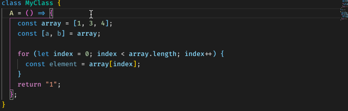

# my-console-log README

使用快捷键快速生成log

## Features

### 增加log
1. 选中变量
2. 使用快捷键alt+shift+l 快速在下插入log，默认格式为`[{C}] [{F}] [{V}]`，输出`console.log('[class] [function] [variable]', variable)`，可在配置中修改需要的格式

### 支持使用snippet输入

- 支持的snippet：

1. cl -> console.log

2. cw -> console.warn

3. ce -> console.error

- 自动识别参数

### 删除该文件所有的log
1. 使用快捷键alt+shift+d  
注： 只针对`console.log`

### 注释该文件所有的log
1. 使用快捷键alt+shift+c   
注： 只针对`console.log`

### 取消注释该文件所有的log
1. 使用快捷键alt+shift+u   
注： 只针对`console.log`

### 增加颜色
1. 开启配置中的`color`选项，输出的代码会带上样式
2. `class/function/variable`的样式可以在配置中修改

注： 必须使用`npm i`安装依赖，使用`cnpm`打包会出现莫名其妙的问题